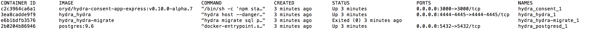
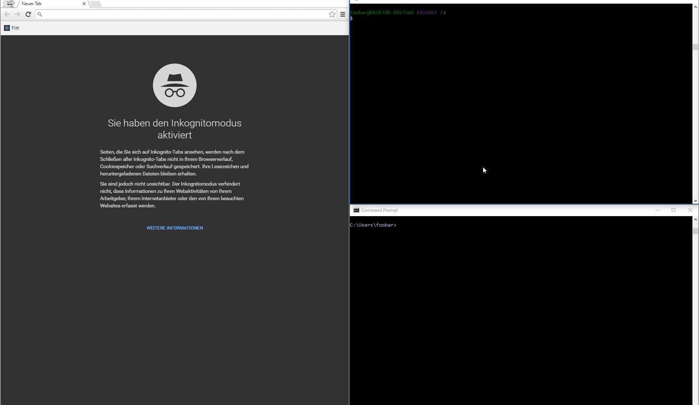
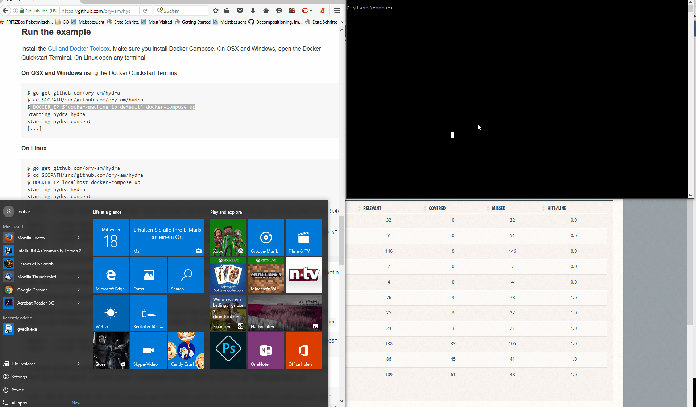

# 5分钟教程

想要完成Hydra的部署非常简单！首先你需要配置一个最新版本的docker环境,，ORY Hydra 的源码提供了一个docker yml的部署文件， 可以轻松部署在docker-compose, 包括ORY Hydra的服务、PostgreSQL数据库和一个权限认证的例子 \(身份提供者\). 







安装 [Docker and Docker Compose](https://github.com/ory-am/hydra#installation) ，然后克隆git项目地址到目录下，如果你电脑上已经安装了Go \(1.8+\)，你也可以尝试用Go下载命令来安成[ zip 文件](https://github.com/ory-am/hydra/archive/master.zip)下载

  `go get github.com/ory/hydra去下载`[ ](https://github.com/ory-am/hydra/archive/master.zip)

```text
$ git clone https://github.com/ory/hydra.git
$ cd hydra
$ git checkout tags/v0.10.10
$ docker-compose -p hydra up --build -d
Starting hydra_mysqld_1
Starting hydra_postgresd_1
Starting hydra_hydra_1

[...]
```

Perfect, everything is running now! Let's SSH into the ORY Hydra container and play around with some of the commands:

```text
$ docker exec -i -t hydra_hydra_1 /bin/sh
root@b4403bb4147f:/go/src/github.com/ory-am/hydra$

# Creates a new OAuth 2.0 client
$ hydra clients create
Client ID: c003830f-a090-4721-9463-92424270ce91
Client Secret: Z2pJ0>Tp7.ggn>EE&rhnOzdt1

# Issues a token for the root client (id: admin)
$ hydra token client
JLbnRS9GQmzUBT4x7ESNw0kj2wc0ffbMwOv3QQZW4eI.qkP-IQXn6guoFew8TvaMFUD-SnAyT8GmWuqGi3wuWXg

# Introspects a token:
$ hydra token validate $(hydra token client)
```

Next, we will perform the OAuth 2.0 Authorization Code Grant:

```text
$ hydra token user --auth-url http://localhost:4444/oauth2/auth --token-url http://localhost:4444/oauth2/token
Setting up callback listener on http://localhost:4445/callback
Press ctrl + c on Linux / Windows or cmd + c on OSX to end the process.
If your browser does not open automatically, navigate to:

    https://192.168.99.100:4444/oauth2/...
```

Great! You installed hydra, connected the CLI, created a client and completed two authentication flows!

